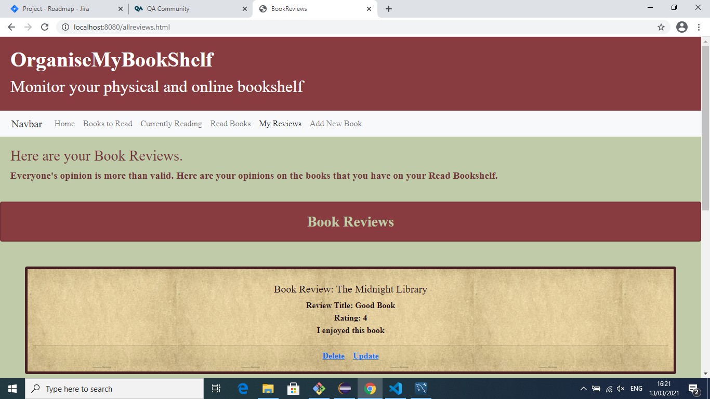

# Project 1: CRUD PROJECT  
### Holly Shanks

###### This is my first project completed at the QA Academy. The project consists of an application which has full CRUD capability for two objects- books and book reviews. The application was made using a mySQL database, a Spring Boot back-end application and HTML/ CSS web design.   

## Project Bookshelf

### Contents

1. Brief
2. JIRA Kanban Board
3. Database and mySQL Structure
4. Data Stack
5. Front-End Development
6. Testing
7. Future Improvements
8. Links to Work
9. Acknowledgment

### 1. Brief

The brief for this project was to create a CRUD application that would cover all the subjects learnt in the first five weeks of my training at the QA Academy.   

As part of the brief the following items were required to be part of the application.

* Kanban Board: Jira
* Database: SQL Server
* Programming language: Java (unless stated otherwise)
* Front-end: HTML, CSS and JavaScript
* Unit Tests: JUnit and Mockito
* Integration Tests: MockMVC and Selenium
* Version Control: Git

Considering this brief I set out to make an application based on my favourite hobby- reading. I wanted the CRUD functionality to allow me to create a book and place it on a "shelf" based on whether I had read it or not. I wanted to be able to view all the books in all different shelves. For the update function I wanted to be able to freely update the book but also to have shortcuts to start or finish the book which would automatically update the status. I also wanted the ability to delete the book. 

I also set out to push myself with this project by adding the ability to a review a book to my application. This meant including another table and another set of CRUD functionalities. This also came with the issue of linking the review to the book. 

### 2. JIRA Kanban Board

I created a JIRA board to track my progress through the project and to make sure I remembered to complete all the tasks I had set myself. I set epics covering the main areas of development and testing. I also created user stories and subtasks to keep track of the tasks I had left to do. 

My JIRA board can be found [here][JIRALink] and examples of the board can be viewed below.

### 3. Database and mySQL structure.

My mySQL was autogenerated from my Spring Application to ensure that the tables created matched with the requirements set out in the domain of the back-end. The EER diagram showing the tables, fields and relationship between the table can be viewed below:

### 4. Data Stack

###### Database

For the database for my project I have 2 databases set up for different profiles. 

For my test profile I have attached the application to a H2 database. This is so any objects created in the database are not stored permanently and have no effect on the data stored by users of the application. This is mainly used for testing- not only with the formal tests in the back-end but for developing new code as well.

For my prod profile, I have attached a mySQL database so that objects created in the application can be stored and retrieved at different times.

###### Back-End

My back-end is a Spring Boot Application and contains the: domains of the object, the DB logic, the object repos, and the object controllers which allow us to make HTTP requests to and from the front-end. Using Spring Boot allows us to communicate with the database and with the front-end, allowing the whole data stack to work together.

###### Front-End

My front-end was designed using HTML, CSS, and javascript. The HTML was used to create the different web pages and to ensure links on items such as the nav bar were working. Most of the styling was done using a core CSS document applied to all HTML documents. Some styling utilised bootstrap to imrpove the look of the item- specifically, the forms and the Navigation Bar. I used JS to add event listeners and make HTTP requests to the back end. Using JS allowed me to make the website function as it should. Some JS documents serve more than one HTML document- however, due to most pages having a different function, I did use several JS documents.

### 5. Front-End Devlopment

The finished front-end looked as below:

I used a relatively neutral colour scheme and kept the design simple but refined. I wanted it to feel clean and easy to use whilst pulling in text and colour choices that reminded me of being in a real library. To make it easy to use I used different pages to break up functionality. The following pages are each of the bookshelves:

I utilised modals to keep the initial page as simple as possible. 

I had seperate pages for storing my reviews. In this page it was important for me that the book title was directly printed with the review which involved using book GET requests on this page.

### 6. Testing

I undertook 3 forms of testing; each for a different purpose. The first two tests were done for books and reviews independantly as there is very little interaction between the two objects until the front-end of the application.

#### Mockito Tests

The Unit Tests I performed were using Mockito. This allowed me to used a Mock Repository which allowed me to check whether my logic was working in the way I expected as opposed to just working. The creation of mock objects and the lack of need for external dependencies makes this form of testing easy to perform unit tests. In addition to this, Unity Testing was important to ensure that all the methods I had written worked independantly so that if an issue arose it would be easy to identify if it was a singular method causing the probelm.

#### Integration Tests

My Integration Tests used the JUnit library and were put in place to test whether the system was working effectively together. These integration tests used mock HTTP requests to test the whole of the back end and whether the different classes were communicating as expected. 

#### Selenium Tests

I have currently only writted a create/read test for the book object. Given more time I would expand this testing to increase the coverage across my front-end.

### 7. Future Improvements

I feel as though I have been ambitious with this project and I have really pushed myself. As a result there are 2 catagories of issues I could identify for future improvement. First more realistic goals that I ran out of time to acheive such as:

* Using improved CSS styling on the forms. 
* Improving the CSS styling and colour scheme on the website in general. Aiming to acheive more of an elevated look. 
* Not having to refresh the page for the review page for the delete and update functions.
* Removing the review if the associated book is deleted.
* More comprehensive testing- focus on Selenium Testing.

The second areas of improvement are areas where I would like to take a project like this. These include the following:

* More complex web design. Including a search bar for both objects. 
* Ability for who wrote the review to be determined. Would involve the use of a third user table, and the addition of join tables.

### 8. Links to All Work

JIRA Board: [Here][JIRALink]

GitHub (Front-End Included in this repo): [Here][GitHubLink]

### 9. Acknowledgements

I would like to acknowledge the QA trainers for all their help on this project. I would also like to thank Team 1 for all their support over the past 5 weeks.

[JIRALink]: https://qarestaurant.atlassian.net/secure/RapidBoard.jspa?rapidView=6&projectKey=PROJ&selectedIssue=PROJ-8
[GitHubLink]: https://github.com/HShanks19/ProjectBookshelf
